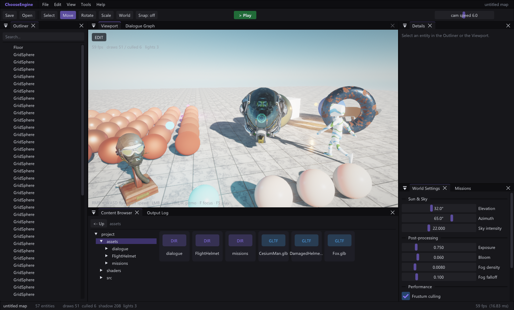
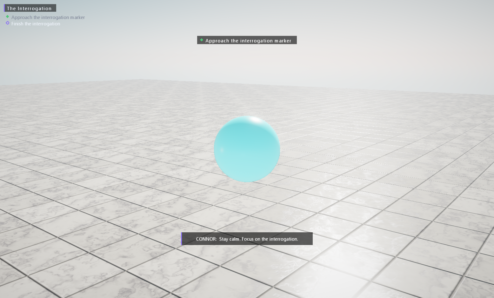

# Aether Engine

**The first agent-native game engine.** A complete 3D engine + editor for indie
developers, built from scratch in C++17 (~25K lines you can actually read),
designed from the ground up so that **an AI coding agent is a first-class
developer on your team** — not a chatbot bolted onto the side.

> **The goal: you + an AI agent = a game studio.**
> Describe a mechanic. The agent authors the blueprint JSON, wires the scene,
> runs the game headless, reads its own logs, screenshots the result, and
> iterates — while you art-direct. Every change is a git diff you can review.



The same world running as a packaged standalone game — HUD, missions,
dialogue, cinematic camera cuts, all driven by JSON data:



## Why another engine?

Unity and Unreal are extraordinary — and structurally hostile to AI agents.
Unreal's content is binary `.uasset` files an agent cannot read or write.
Unity's scenes are GUID soup referencing an opaque import database that only
exists while the editor runs. Neither has a sanctioned way for an agent to
change something and *prove it worked* without a human clicking in the editor.
Retrofitting that would break twenty years of ecosystem — they can't follow.

Aether is built on three pillars:

1. **Agent-native.** Every asset — scenes, visual scripts, materials,
   animation graphs, UI, dialogue, missions, data tables, prefabs — is
   hand-editable, git-diffable JSON. Reference documentation is **generated
   from the engine's live registries** (it can't rot) and ships **inside every
   game project** next to an `AGENTS.md`. A headless verification loop (run N
   frames, grep script logs, screenshot, scene round-trip) lets an agent close
   its own feedback loop with no human in it.

2. **Modular.** Engine features are named modules (physics, audio, scripting,
   ui, particles, animation, ai, narrative) a project can switch off in its
   manifest. Systems hide behind facades (Jolt never leaks past
   `ae::PhysicsWorld`, OpenGL never leaks past `ae::rhi`). Projects extend the
   engine with hot-reloadable C++ plugins that register their own components.

3. **Easy for everyone.** Designers get node canvases for logic, materials,
   animation, dialogue and UI — with hot reload on every one of them (Ctrl+S
   while the game is playing, see it live). Programmers get a one-class C++
   SDK: implement `reflect()`, call `AE_REGISTER_COMPONENT`, and the
   serializer, inspector, prefabs, undo and generated docs all pick your
   component up automatically.

## What's inside

**Renderer** (from-scratch OpenGL 4.5 DSA behind an RHI): Cook–Torrance PBR,
Nishita atmosphere → live IBL, 4 stabilized shadow cascades, SSAO, HDR bloom,
ACES + FXAA, pre-integrated subsurface skin, point/spot/directional lights,
sorted forward transparency, GPU-instanced batching with distance culling,
CPU particles with HDR glow, debug-draw X-ray overlays, GPU pass timers.

**Editor** (Dear ImGui docking, UE-style workspace): viewport with gizmos and
picking, outliner with drag-reparenting, reflection-driven Details inspector,
Content Browser with drag-drop, prefabs, snapshot undo/redo, true
Play-In-Editor (snapshot → play → restore), Profiler, custom borderless
chrome — plus **six node/graph editors**: visual scripting, materials,
animation state machines, dialogue, UI designer, and a data-table spreadsheet.

**Gameplay**: Blueprint-class visual scripting (~82 self-describing nodes:
variables, functions, control flow, events, physics, AI, game systems), Jolt
rigid-body physics + character controller, Recast/Detour navmesh with
NavAgents, XAudio2 3D audio, XInput gamepad with a rebindable action map,
AnimGraph state machines with crossfades, retained-mode game UI with data
binding, save-game checkpoints, data tables, glTF/OBJ/FBX import with a
BC-compressed texture cache.

**Narrative toolkit** (an optional module — Aether is genre-neutral):
dialogue scene graphs with per-node camera cuts, Detroit-style choice prompts
and QTEs, a mission/objective system with story flags, and a dialogue graph
that lights up live during Play like a flowchart.

**AI, twice**: game AI (navmesh agents, script-driven NPCs) and an embedded
**AI dev team** in the editor (planner / coder / designer personas over a
PulseLABS backend with RAG on your project's own docs, proposing complete
asset files you review and apply).

## Architecture

```
AetherHub.exe       launcher: engine installs, project list, new-from-template
AetherEditor.exe    the editor shell
AetherRuntime.exe   standalone game player (what packaged games ship)
AetherCore.dll      the whole engine — shared by all three
```

```
src/
  core/      math, JSON, GUIDs, Win32 window (custom chrome), log, gamepad, HTTP
  rhi/       API-neutral render interface + the OpenGL 4.5 backend
  render/    renderer, shaders, meshes, textures, glTF/OBJ/FBX, material graphs
  engine/    entity/component/world, reflection, registry, scene IO, prefabs,
             assets, missions, input actions, particles, anim graphs, data
             tables, save games, modules, plugins, packager, doc generator
  physics/   Jolt facade + RigidBody/Collider components
  ai/        Recast/Detour navmesh + NavAgent
  audio/     XAudio2 + AudioSource component
  script/    the visual-scripting runtime + node registry
  ui/        from-scratch immediate-mode GUI + retained UIDocument framework
  narrative/ dialogue scenes/player/triggers, choice & QTE UI, mission HUD
  editor/    workspace, inspector, and all graph/panel editors
  ai_assist/ PulseLABS client + dev-team orchestration
shaders/     runtime-loaded GLSL (hot-editable)
Templates/   Blank + Sample project templates (each with Docs/ + AGENTS.md)
tools/       headless smoke tests + AetherDocGen
```

A game project is a folder: `project.aeproj` manifest, `assets/` (all JSON +
models), `Source/` (optional C++ game module), `Plugins/`, and `Docs/` with
the generated component/node reference.

## Build & run

Requires CMake + Visual Studio Build Tools (C++). Jolt and Recast are fetched
at configure time; ImGui/ImGuizmo/ufbx are vendored. Any GPU with GL 4.5.

```
cmake -S . -B build
cmake --build build --config Release

build\bin\Release\AetherHub.exe                                # launcher
build\bin\Release\AetherEditor.exe  --project Templates\Sample # editor
build\bin\Release\AetherRuntime.exe --project Templates\Sample # the game
```

### The agent loop (headless — no human needed)

```
AetherRuntime.exe --project . --frames 300                      # run, read [Script] logs
AetherRuntime.exe --project . --frames 60 --screenshot out.bmp  # visual check
AetherEditor.exe  --project . --resave roundtrip.json           # scene parse check
AetherEditor.exe  --project . --play --frames 200 --screenshot play.bmp
AetherEditor.exe  --project . --package Dist                    # ship it
AetherDocGen . --with-module                                    # regenerate reference docs
```

Smoke tests (`AetherPhysSmoke`, `AetherNavSmoke`, `AetherSaveSmoke`,
`AetherInputSmoke`, `AetherUndoSmoke`, `AetherAiSmoke`) verify physics,
navigation, save games, input, undo and the AI pipeline from the command line.

## Status

Alpha, Windows-only for now (a D3D12/Vulkan-ready RHI split is done; the
cross-compile + new backend is the active workstream). The renderer and editor
punch at AA level; see [AUDIT.md](AUDIT.md) for the honest gap analysis
against Unity/Unreal and the full roadmap.

## Controls

| Editor | |
|---|---|
| RMB + WASD / QE | fly the viewport freecam (Shift = fast, scroll = speed) |
| LMB | pick entity · F focus · Del delete · Ctrl+D duplicate |
| Q / W / E / R | gizmo: none / translate / rotate / scale (Ctrl = snap) |
| Ctrl+Z / Ctrl+Y | undo / redo · Ctrl+S save · F5 Play/Stop |

| Game | |
|---|---|
| WASD / left stick | move (Shift = run) · Space / pad-A jump |
| RMB drag / right stick | look |
| 1-9 / mouse | dialogue choices · shown key(s) for QTEs |
